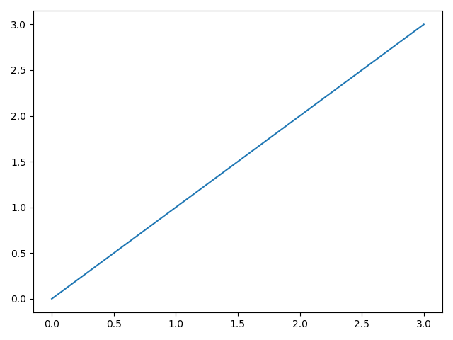
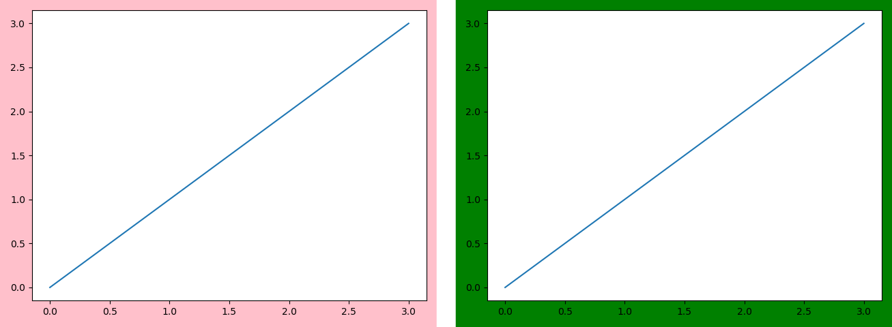
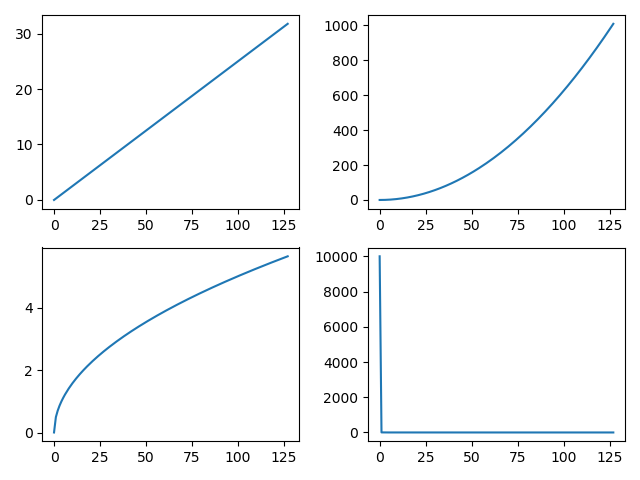
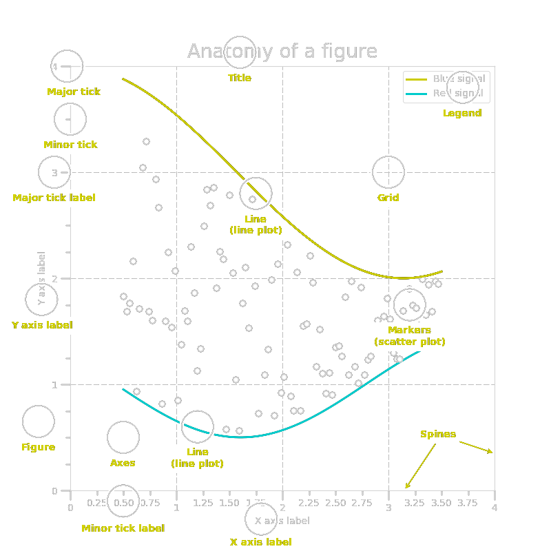
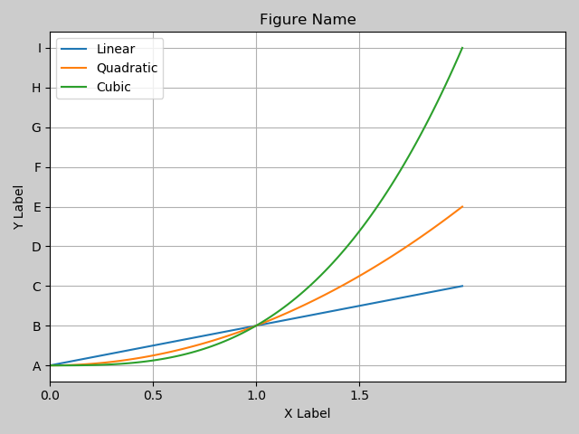
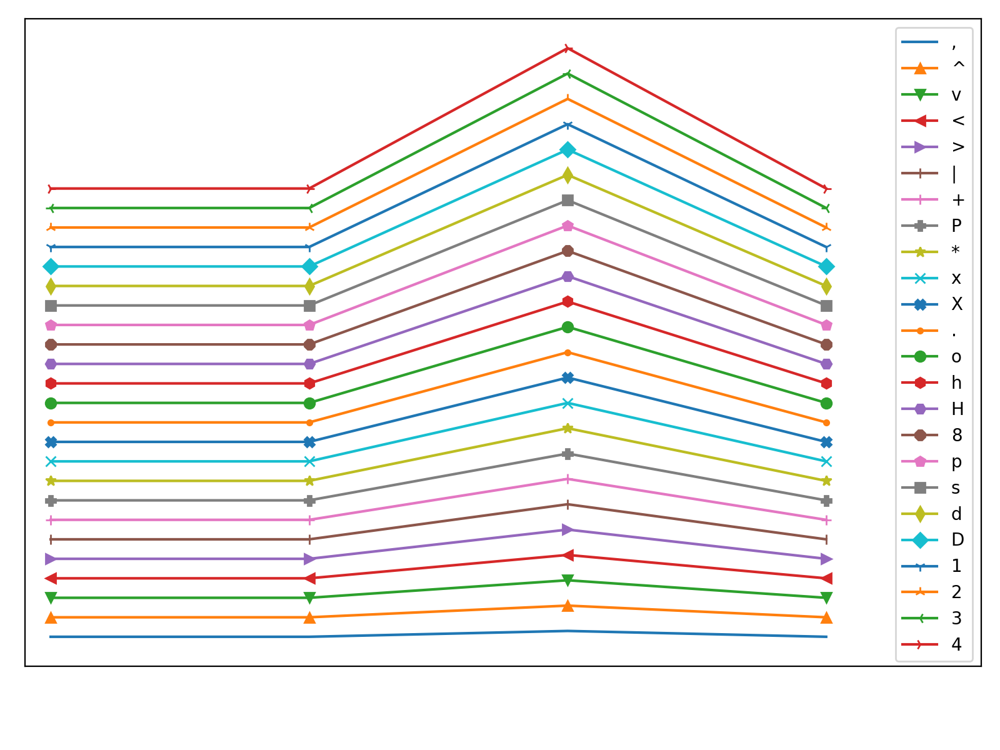
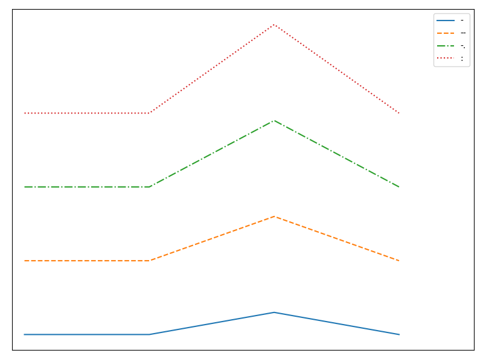
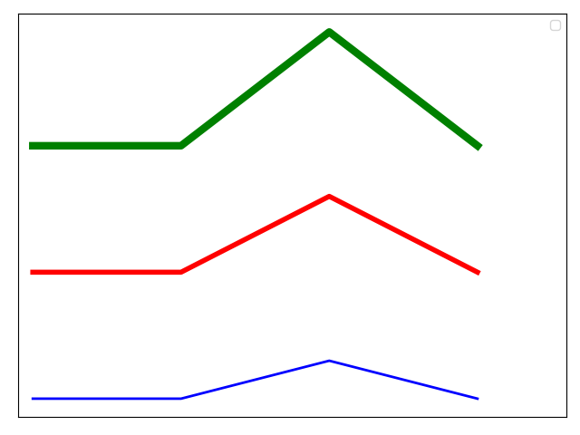
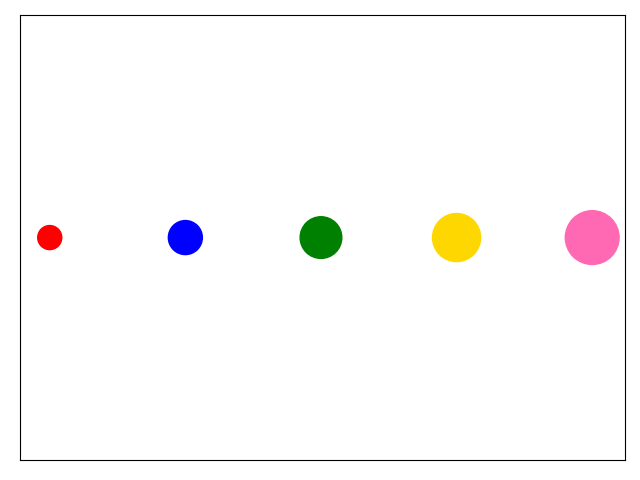

<link rel="stylesheet" href="https://zhmhbest.gitee.io/hellomathematics/style/index.css">
<script src="https://zhmhbest.gitee.io/hellomathematics/style/index.js"></script>

# [Matplotlib](./index.html)

[TOC]

>- [Matplotlib APIs](https://matplotlib.org/api/index.html#modules)
>- [Matplotlib pyplot](https://matplotlib.org/api/pyplot_summary.html#matplotlib-pyplot)
>- [Matplotlib Examples](https://matplotlib.org/gallery/index.html)

```py
import numpy as np
import pandas as pd
import matplotlib.pyplot as plt
```

## PyPlot

### Figure

```py
# plt.figure()
plt.plot(range(4))
plt.show()
# plt.close()
```




```py
"""
    创建新图形
    def figure(
        num=None,        # autoincrement if None, else integer from 1-N
        figsize=None,    # {(float, float)} inches to (W, H), defaults (6.4, 4.8)
        dpi=None,        # {int} defaults 100
        facecolor=None,  # {str} the background color
        edgecolor=None,  # {str} the border color
        ...
        clear=False      # {bool} If True and the figure already exists, then it is cleared.
    )
"""
# 创建
fig1, fig2 = plt.figure(facecolor='pink'), plt.figure(facecolor='green')
ax1, ax2 = fig1.add_subplot(), fig2.add_subplot()

# 绘制
ax1.plot(range(4))
ax2.plot(range(4))

# 显示
plt.show(figure=fig1)
plt.show(figure=fig2)

# 关闭
plt.close(fig1)
plt.close(fig2)
```



### Subplot

**数据**

```py
x = np.arange(0.0001, 32, 0.25)
```

**方法1**

```py
plt.subplot(221)
plt.plot(x)

plt.subplot(222)
plt.plot(x**2)

plt.subplot(223)
plt.plot(np.sqrt(x))

plt.subplot(224)
plt.plot(1/x)

plt.show()
```

**方法2**

```py
fig = plt.figure()
ax00 = fig.add_subplot(221)
ax01 = fig.add_subplot(222)
ax10 = fig.add_subplot(223)
ax11 = fig.add_subplot(224)

ax00.plot(x)
ax01.plot(x**2)
ax10.plot(np.sqrt(x))
ax11.plot(1/x)

plt.show(figure=fig)
```

**方法3**

```py
fig, axs = plt.subplots(2, 2)

axs[0][0].plot(x)
axs[0][1].plot(x**2)
axs[1][0].plot(np.sqrt(x))
axs[1][1].plot(1/x)

plt.show(figure=fig)
```



### Anatomy



```py
# 数据准备
x = np.linspace(0, 2, 100)

# 创建图像和子图
# fig, ax = plt.subplots()
fig = plt.figure(facecolor='#CCCCCC')
ax = fig.add_subplot()

# 绘制三条曲线
ax.plot(x, x, label="Linear")
ax.plot(x, x**2, label="Quadratic")
ax.plot(x, x**3, label="Cubic")

# 设置轴名称
# plt.xlabel("X Label")
# plt.ylabel("Y Label")
ax.set_xlabel("X Label")
ax.set_ylabel("Y Label")

# 设置轴刻度
ax.set_xticks([i/2 for i in range(4)])
ax.set_yticks(range(9))

# 替换轴刻度名称
# ax.set_xticks(...)
ax.set_yticklabels([chr(65+i) for i in range(9)])

# 设置轴范围
ax.set_xlim(0, 2.5)
# ax.set_ylim(..., ...)

# 添加标题、图例、网格
# plt.title("Figure Name")
ax.set_title("Figure Name")
ax.legend()
ax.grid()

# 显示图像
plt.show(figure=fig)
```



## 折线图

### Attribute

```py
def get_add_plotter():
    def adder(params):
        nonlocal index
        index += 0.2
        plt.plot([index, index, 1.3*index, index], **params)
    index = 0
    return adder


add_plotter = get_add_plotter()
plt.figure(figsize=(8, 6), dpi=200)
# ■■■■■■■■■■■■■■■■■■■■■■■■■■■■■■■■

# Test code here.

# ■■■■■■■■■■■■■■■■■■■■■■■■■■■■■■■■
plt.yticks([])
plt.xticks([])
plt.xlim(-0.1, 3.6)
plt.legend()
plt.show()
```

#### Marker

```py
for ch in [
    ',',
    '^', 'v', '<', '>',
    '|', '+', 'P',
    '*', 'x', 'X',
    '.', 'o', 'h', 'H', '8',
    'p', 's',
    'd', 'D',
    '1', '2', '3', '4'
]:
    add_plotter({
        'label': ch,
        'marker': ch
    })
```



#### Linestyle

```py
for ch in [
    '-', '--', '-.', ':'
]:
    add_plotter({
        'label': ch,
        'linestyle': ch
    })
```



#### Color+LineWidth

```py
add_plotter({
    'color': 'blue',
    'linewidth': 2
})

add_plotter({
    'color': 'red',
    'linewidth': 4
})

add_plotter({
    'color': 'green',
    'linewidth': 6
})
```




## 散点图

```py
"""
    x, y: 坐标
    s: {int|sequence} 大小
    c: {str|sequence} 颜色
    marker:
    ...
"""
test_length = 5
test_size = [300*(1+i) for i in range(test_length)]
plt.scatter(
    range(test_length), [1 for i in range(test_length)],
    s=test_size,
    c=['red', 'blue', 'green', 'gold', 'hotpink'], 
    marker='o'
)

plt.yticks([])
plt.xticks([])
plt.show()
```


